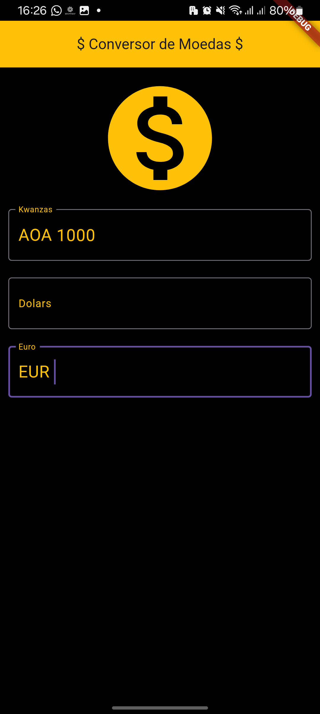
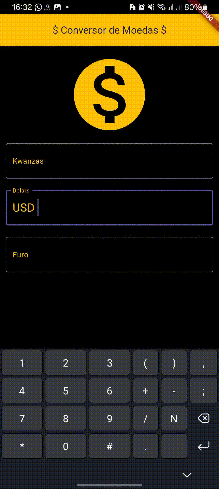

# Conversor de Moedas

## Descrição

O Conversor de Moedas é um aplicativo Flutter que permite aos usuários converter valores entre diferentes moedas, especificamente entre Kwanzas (AOA), Dólares (USD) e Euros (EUR). O aplicativo utiliza taxas de câmbio em tempo real para fornecer conversões precisas.


## Funcionalidades

- Conversão em tempo real entre AOA, USD e EUR
- Interface de usuário intuitiva e responsiva
- Atualização automática das taxas de câmbio


## Capturas de Tela




## Instalação
1. Clone o repositório:
   ```bash
   git clone https://github.com/seu-usuario/conversor-moedas.git
   ```

2. Navegue até o diretório do projeto:
   ```bash
   cd conversor-moedas
   ```
3. Instale as dependências:
   ```bash
   flutter pub get
   ```

4. Execute o aplicativo:
   ```bash
   flutter run
   ```

## Uso



1. Abra o aplicativo
2. Digite o valor em uma das moedas (AOA, USD ou EUR)
3. Os valores equivalentes nas outras moedas serão calculados automaticamente

## Tecnologias Utilizadas

- Flutter
- Dart
- API de taxas de câmbio  [API de Cotações da AwesomeAPI](https://docs.awesomeapi.com.br/api-de-moedas) 

## Estrutura do Projeto

```
lib/
├── core/
│   ├── config/
│   ├── domain/
│   └── use_case/
├── infrastructure/
│   └── adapters/
└── presentation/
    └── screens/
```